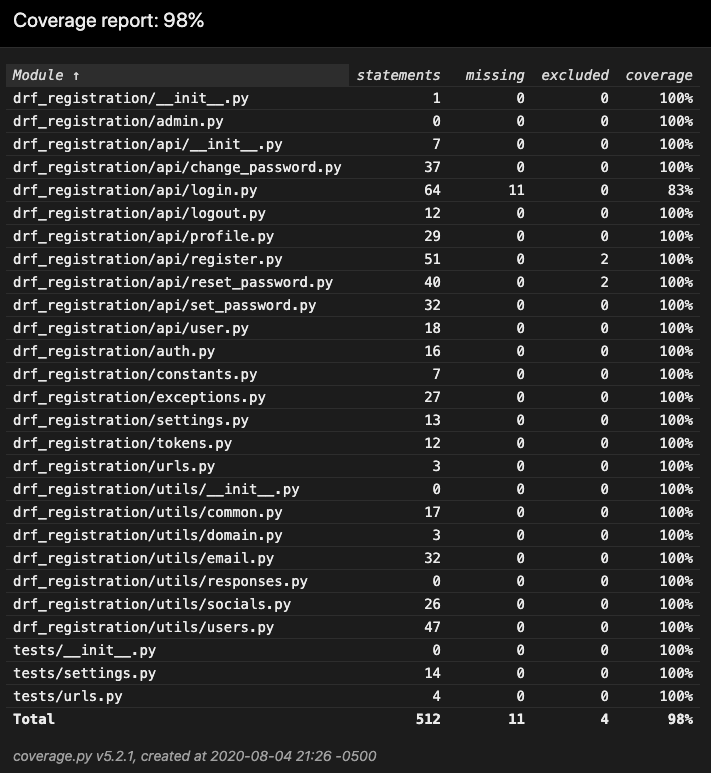

# Django Rest Framework Registration

User registration base on Django Rest Framework.

Check the document at https://drf-registration.readthedocs.io/

## Requirements
- Django (>=2.0)
- Django REST Framework (>=3.8.2)
- Python (>=3.6)

## Features
- [x] Register
- [x] Verify/activate account by token sent to email
- [x] Login use token
- [x] Logout
- [x] User profile
- [x] Change password
- [x] Reset password

## Future Features
- [x] Login by socials (Facebook, Google)
- [x] Set password when login by social
- [x] Sync user account with socials
- [x] HTML email configuration
- [x] Test coverage (98%)

## Base APIs Design

Assuming that base resource is `/api/v1/accounts/`

### Regsiter
#### POST: `/register/`
Register new user

### Verify account
#### POST: `/verify/`
Verify account by email

### Login
#### POST: `/login/`
Login to the system use username/email and password

### Logout
#### POST: `/logout/`
Logout of the system

### Profile
#### GET: `/profile/`
Get user profile

#### PUT: `/profile/`
Update user profile

### Change password
#### PUT: `/change-password/`
Change user password

### Set password
#### PUT: `/set-password/`
Set user password when login with social account

## Installing
- Add `drf_registration` in `INSTALLED_APPS`
```
INSTALLED_APPS = [
    ...
    'rest_framework',
    'rest_framework.authtoken',
    'drf_registration',
    ...
]
```

- Include urls of `drf_registration` in `urls.py`
```
urlpatterns = [
    ...
    path('/api/accounts/', include('drf_registration.urls')),
    ...
]
```

## Settings
- Set `AUTHENTICATION_BACKEND` for support login by multiple custom fields and check inactivate user when login:

```
AUTHENTICATION_BACKENDS = [
    'drf_registration.auth.MultiFieldsModelBackend',
]
```

You can update login username fields by change `LOGIN_USERNAME_FIELDS` in `DRF_REGISTRATION` object. Default to `['username, email,]`.

- Set `DEFAULT_AUTHENTICATION_CLASSES` in `REST_FRAMEWORK` configuration

```
REST_FRAMEWORK = {
    'DEFAULT_AUTHENTICATION_CLASSES': [
        'rest_framework.authentication.TokenAuthentication',
    ],
}
```

### Design settings
```
DRF_REGISTRATION = {

}
```

## Command line

- Unit Test
```
make test
```
*You can add `ARGS="specific_folder/"` or `ARGS="specific_file.py"` to run specific test cases.*

- Run pylint
```
make pylint
```

- Build & run docs local server
```
make docs
```
Access docs server at http://localhost:8080

- Clean
```
make clean
```

## Test coverage



